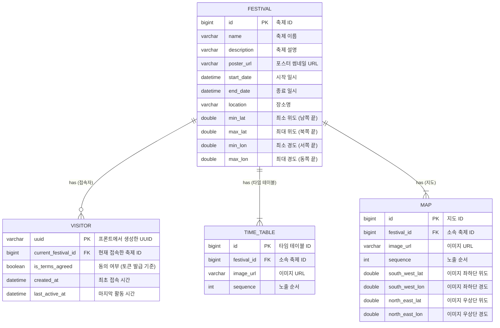

# API Wiki ERD

```mermaid
erDiagram
    FESTIVAL ||--o{ VISITOR : "has (접속자)"    
    FESTIVAL ||--|{ TIME_TABLE : "has (타임 테이블)"
    FESTIVAL ||--|{ MAP : "has (지도)"

	VISITOR {
    varchar uuid PK "프론트에서 생성한 UUID"
    %% 프론트 측에서 생성해 서버쪽으로 넘겨주는 형식으로 구
    bigint current_festival_id FK "현재 접속한 축제 ID"
    boolean is_terms_agreed "동의 여부 (토큰 발급 기준)"
    datetime created_at "최초 접속 시간"
    datetime last_active_at "마지막 활동 시간"
    }

    FESTIVAL {
    bigint id PK "축제 ID"
    varchar name "축제 이름"
    varchar description "축제 설명"
    varchar poster_url "포스터 썸네일 URL"
    datetime start_date "시작 일시"
    datetime end_date "종료 일시"
    varchar location "장소명"
        
    %% 축제 허용 범위
    double min_lat "최소 위도 (남쪽 끝)"
    double max_lat "최대 위도 (북쪽 끝)"
    double min_lon "최소 경도 (서쪽 끝)"
    double max_lon "최대 경도 (동쪽 끝)"
    }

    TIME_TABLE {
    bigint id PK "타임 테이블 ID"
    bigint festival_id FK "소속 축제 ID"
    varchar image_url "이미지 URL"
    int sequence "노출 순서"
    }
    
    MAP {
    bigint id PK "지도 ID"
    bigint festival_id FK "소속 축제 ID"
    varchar image_url "이미지 URL"
    int sequence "노출 순서"
        
    %% 이미지를 지도에 매핑하기 위한 좌표
    double south_west_lat "이미지 좌하단 위도"
    double south_west_lon "이미지 좌하단 경도"
    double north_east_lat "이미지 우상단 위도"
    double north_east_lon "이미지 우상단 경도"
    }
```