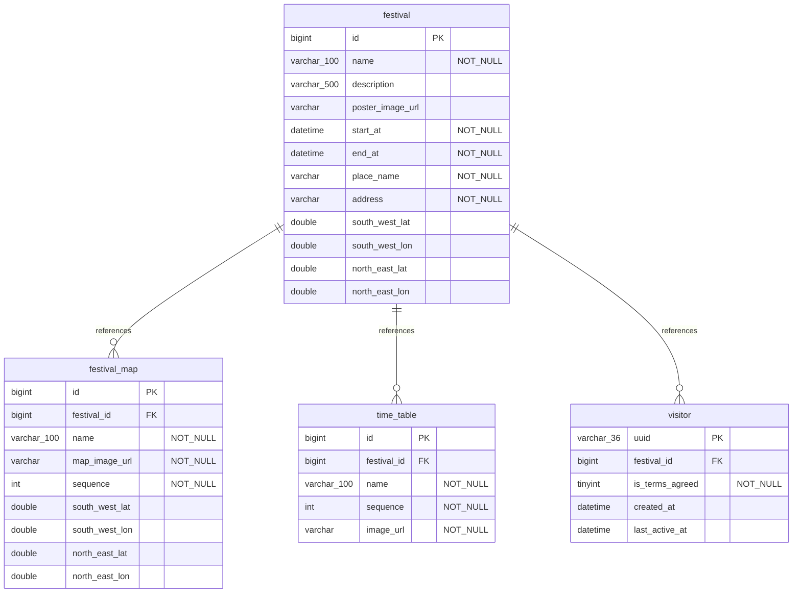

# Wagle ERD

```mermaid
erDiagram
    festival ||--o{ festival_map : "references"
    festival ||--o{ time_table : "references"
    festival ||--o{ visitor : "references"

    festival {
        bigint id PK
        varchar_100 name "NOT_NULL"
        varchar_500 description
        varchar poster_image_url
        datetime start_at "NOT_NULL"
        datetime end_at "NOT_NULL"
        varchar place_name "NOT_NULL"
        varchar address "NOT_NULL"
        double south_west_lat
        double south_west_lon
        double north_east_lat
        double north_east_lon
    }

    festival_map {
        bigint id PK
        bigint festival_id FK
        varchar_100 name "NOT_NULL"
        varchar map_image_url "NOT_NULL"
        int sequence "NOT_NULL"
        double south_west_lat
        double south_west_lon
        double north_east_lat
        double north_east_lon
    }

    time_table {
        bigint id PK
        bigint festival_id FK
        varchar_100 name "NOT_NULL"
        int sequence "NOT_NULL"
        varchar image_url "NOT_NULL"
    }

    visitor {
        varchar_36 uuid PK
        bigint festival_id FK
        tinyint is_terms_agreed "NOT_NULL"
        datetime created_at
        datetime last_active_at
    }

```
